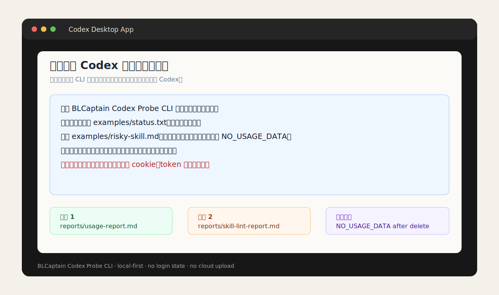
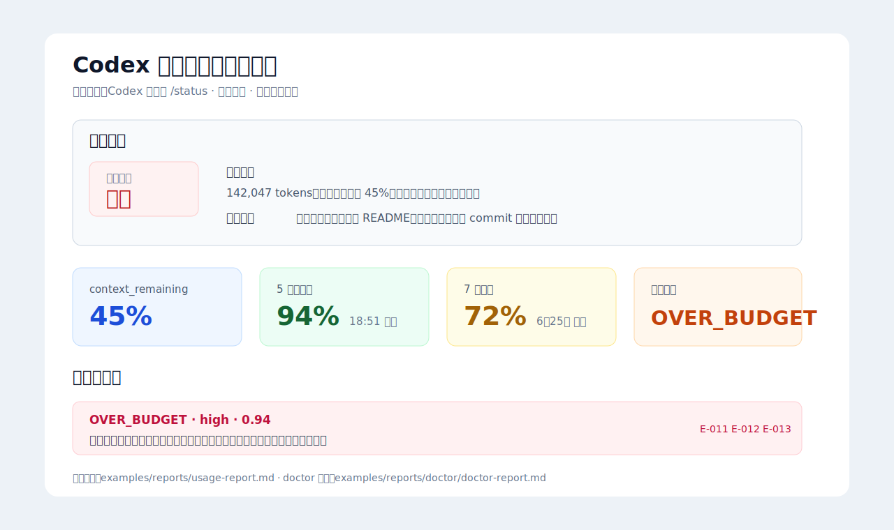
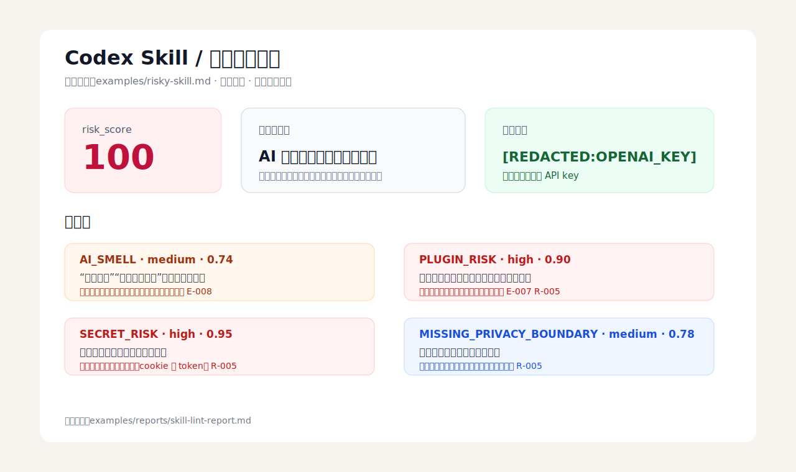

# BLCaptain Codex Probe CLI

> A local-first, read-only CLI for Codex usage governance and Skill / output quality checks: explain why a task is expensive, how to downgrade, and when to stop.

[中文 README](README.md)


> **Fastest path**:
>
> You do not need to understand the CLI first. Open this repository folder in the Codex desktop app, then paste the [Codex desktop prompt](docs/CODEX_DESKTOP_PROMPT.md) into Codex.
>
> ```text
> Please use BLCaptain Codex Probe CLI to analyze the /status text I provide below:
> why it is expensive, how to downgrade, and when to stop.
> Only process text I explicitly provide. Do not read browsers, cookies, tokens, or private folders.
> ```

> **Developer install**:
>
> ```bash
> git clone https://github.com/dososo/BLCaptain-Codex-Probe-CLI.git
> cd BLCaptain-Codex-Probe-CLI
> python3 -m venv .venv
> . .venv/bin/activate
> python -m pip install .
> ```

---

## Screenshots

<p>
  
</p>

In the Codex desktop app, one prompt can ask Codex to install locally, import sample data, generate reports, inspect a Skill, and verify deletion.

| Task-level usage report | Skill / output quality inspection |
|---|---|
|  |  |
| Puts `total_tokens`, budget state, quota remaining, and stop advice in one view, making it easier to decide whether to continue, downgrade, or stop. See [examples/reports/usage-report.md](examples/reports/usage-report.md). | Flags AI-smell, plugin risk, sensitive data, and missing privacy boundaries, while showing redacted evidence snippets. See [examples/reports/skill-lint-report.md](examples/reports/skill-lint-report.md). |

## What It Is

BLCaptain Codex Probe CLI is a local command-line tool. It is not a Codex Skill, and it is not a replacement for the official OpenAI usage dashboard. The real point is not "one more command"; it is to help Codex users notice earlier: **why this task is expensive, how to downgrade, and when to stop**.

It focuses on two P0 workflows:

1. **Task-level token and quota governance**: import a user-provided `/status` text or manual JSON sample, generate a task-level usage report, and explain where the cost comes from, whether the task is close to budget, and whether the next move should be downgrade, split, or stop.
2. **Skill / output quality inspection**: import a Skill file, prompt, or AI-generated output, and check for AI-smell, plugin risk, missing acceptance criteria, missing privacy boundaries, and sensitive information leakage.

This is a **Watch / validation-stage v0.3** project. It is suitable for real local trials and open-source validation, but it does not promise savings, unlimited quota, quota boosts, or business success.

If you are not a developer, treat it as a copyable workflow: paste `/status` into Codex and ask Codex to run the local CLI for you. The CLI is the underlying tool; the user entry point is one prompt.

## Naming

| Purpose | Name |
|---|---|
| Product name | BLCaptain Codex Probe CLI |
| GitHub repository | `BLCaptain-Codex-Probe-CLI` |
| Python package | `blcaptain-codex-probe` |
| Primary command | `codex-probe` |
| Short alias | `probe` |
| Compatibility commands | `blcaptain-codex-probe`, `codex-usage-skill-probe` |

Why not call it a Skill: this project is not an instruction package loaded by an Agent. It is a CLI that can be used by humans or Agents. It can inspect Skills, but it is not itself a Skill.

## Why This Exists

Many Codex users do not mainly struggle with prompt writing. They struggle with process control:

1. **They do not know why a task became expensive**: a task ends, the context is huge, output is long, or the selected mode was heavier than needed, but there is no task-level explanation.
2. **They do not know how to downgrade**: quota is getting tight, but it is unclear whether to split the task, reuse cached input, switch model, or stop and preserve the current result.
3. **Skill and output quality are inconsistent**: wrong plugins, generic AI tone, and weak delivery artifacts create extra manual cleanup.
4. **Safety boundaries are unclear**: examples may include API keys, cookies, phone numbers, emails, or phrases around bypassing login, account sharing, or avoiding billing.

The principle is simple: **only analyze local materials explicitly provided by the user; only provide reviewable suggestions; never proxy, bypass, or upload.**

## What You Get

| Area | Output |
|---|---|
| **Input** | `/status` text, manual JSON, Skill files, prompts, AI output text |
| **Storage** | Local SQLite database, controlled by `--db` |
| **Usage analysis** | Tokens, credits, quota remaining, budget risk, downgrade advice, stop advice |
| **Quality inspection** | AI-smell, plugin risk, missing acceptance criteria, missing privacy boundaries, redaction |
| **Reports** | Markdown reports, JSON command output, reviewable `evidence_id` values |
| **Deletion** | `delete --all --yes` clears local business data while keeping minimal audit logs |

## What It Solves

Good fits:

- You want to understand why a Codex task consumed many tokens or credits.
- You want to make "continue / downgrade / stop" a reviewable decision.
- You want to inspect a Skill or AI output before publishing or delivering it.
- You want a local tool for light developers, creators, or internal teams.
- You want privacy boundaries and do not want to upload usage data, Skills, or outputs.

Poor fits:

- You want to replace the official OpenAI usage dashboard or `/status`.
- You want the tool to automatically read Codex login state, browser cookies, system credentials, or production data.
- You want to proxy, intercept, or modify Codex requests.
- You want to bypass login, phone verification, subscriptions, region restrictions, or official billing.
- You want guaranteed savings, unlimited quota, quota boosts, or business success.

## Core Capabilities

### 1. Import Usage Data

If you use the **Codex desktop app**, you do not need to understand the commands first. Open this repository folder in Codex and say:

```text
Please use BLCaptain Codex Probe CLI to run a local usage analysis for me:
1. If it is not installed yet, create a local virtual environment in this project and install it.
2. Import examples/status.txt.
3. Generate a task-level usage report at reports/usage-report.md.
4. Inspect examples/risky-skill.md and write the report to reports/skill-lint-report.md.
5. Tell me the report paths, key risks, and whether I should downgrade or stop.
Do not upload any data. Do not read browser cookies, tokens, or system credentials.
```

If you want to analyze your own `/status`, paste the text into Codex and say:

```text
This is my Codex /status output. Please redact obvious keys, cookies, tokens, emails, and phone numbers first,
save it as .probe/my-status.txt, then use BLCaptain Codex Probe CLI to generate a usage report.
Write the report to reports/my-usage-report.md and explain in plain language:
why it is expensive, how to downgrade, and when to stop.
```

Import a `/status` text sample:

```bash
codex-probe --db .probe/demo.db import \
  --status examples/status.txt \
  --goal "Generate delivery report"
```

Import a manual JSON sample:

```bash
codex-probe --db .probe/demo.db import \
  --manual-json examples/manual-usage.json \
  --goal "Manual sample acceptance"
```

The CLI only reads local files explicitly provided by the user. It does not scan system directories.

### 2. Generate a Task-Level Usage Report

```bash
codex-probe --db .probe/demo.db usage-report \
  --budget-tokens 100000 \
  --out reports/usage-report.md
```

The report explains:

- Model, mode, input tokens, output tokens, cached tokens, and total tokens.
- Whether the task is over budget or close to budget.
- Whether to downgrade, split the task, reuse cached input, or stop non-essential work.
- PRD-linked `evidence_id` values such as `E-011`, `E-012`, and `E-013`.

### 3. Inspect Skills or AI Outputs

```bash
codex-probe --db .probe/demo.db skill-lint \
  examples/risky-skill.md \
  --out reports/skill-lint-report.md
```

The inspection checks:

- AI-smell and template-like wording.
- Risky plugin-related claims, bypass language, account sharing, or billing avoidance.
- Missing acceptance criteria.
- Missing privacy and deletion boundaries.
- API keys, cookies, tokens, emails, phone numbers, and similar sensitive data.

### 4. Delete Local Data

```bash
codex-probe --db .probe/demo.db delete --all --yes
```

After deletion, a usage report should return:

```json
{
  "ok": false,
  "error": {
    "code": "NO_USAGE_DATA"
  }
}
```

## Installation

Requirements:

- Python 3.10+
- Local command-line access
- No OpenAI API key required
- No Codex login required

Install locally:

```bash
git clone https://github.com/dososo/BLCaptain-Codex-Probe-CLI.git
cd BLCaptain-Codex-Probe-CLI
python3 -m venv .venv
. .venv/bin/activate
python -m pip install .
codex-probe --version
```

Available commands:

```bash
codex-probe --version
blcaptain-codex-probe --version
probe --version
```

## Usage

The friendliest path is to open this repository folder in the **Codex desktop app** and say:

```text
Please use BLCaptain Codex Probe CLI to run a complete local acceptance flow:
install dependencies, import examples/status.txt, generate a usage report,
inspect examples/risky-skill.md, delete local business data, and confirm NO_USAGE_DATA afterward.
When done, only give me the report paths, key risks, next-step advice, and verification result.
```

If you already have your own `/status` or Skill text, say:

```text
Please use BLCaptain Codex Probe CLI to analyze the material I provide below.
Goal: explain why this Codex task is expensive, how to downgrade, and when to stop;
also inspect the Skill / output for AI-smell, plugin risk, missing acceptance criteria, or sensitive data.
Only process text I explicitly provide. Do not read browsers, login state, cookies, tokens, or private folders.
```

Codex can run the following commands for you. You can also run them manually.

Minimal workflow:

```bash
mkdir -p .probe reports

codex-probe --db .probe/demo.db import \
  --status examples/status.txt \
  --goal "Generate delivery report"

codex-probe --db .probe/demo.db usage-report \
  --budget-tokens 100000 \
  --out reports/usage-report.md

codex-probe --db .probe/demo.db skill-lint \
  examples/risky-skill.md \
  --out reports/skill-lint-report.md

codex-probe --db .probe/demo.db delete --all --yes
```

You get:

1. A task-level usage self-check report.
2. A Skill / output quality inspection report.
3. JSON command output for Agents or scripts.
4. A verifiable `NO_USAGE_DATA` result after deletion.

## Workflow: Eight-Step Local Acceptance

The project is built and accepted through eight steps:

1. **Research**: read the PRD, samples, user scenarios, and boundaries.
2. **Analysis**: define input formats, risk rules, error codes, and report structure.
3. **Plan**: split P0 commands, tests, acceptance scripts, and release materials.
4. **Development**: implement the CLI, SQLite storage, report rendering, redaction, and deletion.
5. **Verification**: run end-to-end flows for import, report, inspection, and deletion.
6. **Testing**: run unit tests and equivalent static checks.
7. **Audit acceptance**: check README, LICENSE, CHANGELOG, CI, privacy docs, and release checklist.
8. **Summary**: record completion status, residual risks, and next-version suggestions.

If a step fails, inspect logs and evidence first instead of guessing.

## Local Commands

Run tests:

```bash
PYTHONPATH=src python3 -m unittest discover -s tests
```

Compile check:

```bash
python3 -m compileall src tests scripts/run_acceptance.py
```

End-to-end acceptance:

```bash
python3 scripts/run_acceptance.py
```

The acceptance script writes local evidence:

```text
acceptance-artifacts/<timestamp>/
├── commands.md
├── commands.json
├── usage-report.md
├── skill-lint-report.md
└── probe.db
```

`acceptance-artifacts/` is ignored by Git and should not be committed.

## Examples and Prompts

| File | Purpose |
|---|---|
| `docs/CODEX_DESKTOP_PROMPT.md` | Copyable workflow prompts for the Codex desktop app |
| `docs/SOCIAL_POSTS.md` | Draft posts for X and Xiaohongshu |
| `examples/status.txt` | `/status` text sample |
| `examples/manual-usage.json` | Manual JSON usage sample |
| `examples/risky-skill.md` | Risky sample with AI-smell, plugin risk, and fake secrets |
| `examples/clean-skill.md` | Safer Skill sample |
| `examples/optimized-skill.md` | Optimized Skill sample based on the inspection report |
| `examples/reports/optimized-skill-lint-report.md` | Inspection report for the optimized Skill |

The example secret is fake. Reports redact common API keys, tokens, cookies, emails, and phone numbers.

## Data and Privacy

- Does not log in to OpenAI or Codex.
- Does not read browser cookies, tokens, keychains, or system credentials.
- Does not proxy, intercept, or modify Codex requests.
- Does not bypass login, phone verification, subscriptions, regions, or official billing.
- Does not upload data to the cloud.
- Does not automatically install, enable, or modify Skills.
- Only processes local files explicitly provided by the user.
- Local business data can be deleted with `delete --all --yes`.

See [Privacy and Security](docs/PRIVACY_SECURITY.md).

## Directory Structure

```text
BLCaptain-Codex-Probe-CLI/
├── assets/screenshots/               # README screenshots
├── examples/reports/                  # Real sample reports
├── README.md                         # Chinese README
├── README.en.md                      # English README
├── CHANGELOG.md                      # Changelog
├── LICENSE                           # MIT License
├── pyproject.toml                    # Python package and CLI entry points
├── docs/
│   ├── CODEX_DESKTOP_PROMPT.md       # Codex desktop prompts
│   ├── PRIVACY_SECURITY.md           # Privacy and security boundaries
│   ├── RELEASE_CHECKLIST.md          # Release checklist
│   └── SOCIAL_POSTS.md               # Social post drafts
├── examples/                         # Reproducible samples
├── scripts/
│   └── run_acceptance.py             # End-to-end acceptance script
├── src/codex_usage_skill_probe/       # CLI source code
└── tests/                            # Unit and end-to-end tests
```

## Acceptance Criteria

Before v0.3 release:

- The project can be installed from a clean environment with `python -m pip install .`.
- `codex-probe --version` returns the current version.
- The CLI can import `/status` or manual JSON samples.
- The CLI can generate a task-level usage report.
- The CLI can generate a Skill / output quality inspection report.
- The CLI can delete local business data.
- After deletion, another report returns `NO_USAGE_DATA`.
- Reports do not leak full API keys, cookies, tokens, emails, or phone numbers.
- README, LICENSE, CHANGELOG, CI, privacy docs, and release checklist are present.

Current local acceptance evidence:

```text
PYTHONPATH=src PYTHONDONTWRITEBYTECODE=1 python3 -m unittest discover -s tests
.....
Ran 8 tests
OK

PYTHONDONTWRITEBYTECODE=1 python3 -m compileall src tests scripts/run_acceptance.py
OK

PYTHONDONTWRITEBYTECODE=1 python3 scripts/run_acceptance.py
acceptance passed: acceptance-artifacts/20260622T094640Z
```

## Roadmap

- Support more `/status` text formats.
- Add HTML / JSON report schema snapshot tests.
- Add finer-grained Skill risk rules.
- Add multi-task usage trend comparison.
- Add report template customization.
- Provide lighter installation options such as Homebrew or uvx.

## FAQ

**Q: Is this a Codex Skill?**

A: No. It is a CLI. It can inspect Skills or output text, but it is not an Agent-loaded Skill instruction package.

**Q: Does it require an OpenAI API key?**

A: No. It only analyzes local text or JSON explicitly provided by the user.

**Q: Can it directly read my Codex usage?**

A: No. It does not read login state or the official dashboard. You provide `/status` text or manual JSON.

**Q: Can it guarantee lower cost?**

A: No. It explains risk and suggests downgrade or stop actions. Final decisions remain yours.

**Q: Does it store my data?**

A: It stores data only in the local SQLite database path you provide. Use `delete --all --yes` to delete business data.

**Q: Why keep the `probe` command?**

A: `codex-probe` is the primary public command. `probe` is a short alias for local convenience and script compatibility.

## Author

Created and maintained independently by **BLCaptain**.

- GitHub: [@dososo](https://github.com/dososo)
- X / Twitter: [@thinkszyg](https://x.com/thinkszyg)
- Email: [blteam2026@outlook.com](mailto:blteam2026@outlook.com)
- Maintainer of the open Chinese traditional pattern archive: [wenyang.net](https://wenyang.net)

If this project helps you, stars, shares, and conversations on X are welcome.

## License

MIT License. See [LICENSE](LICENSE).
