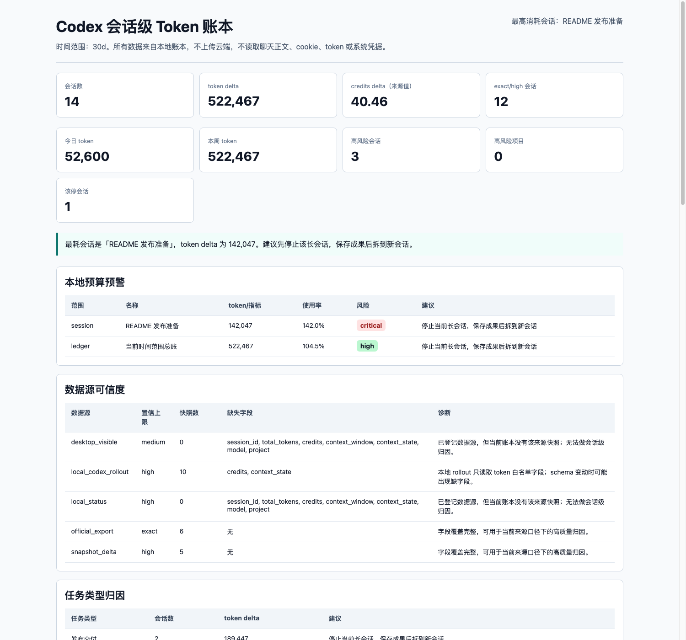

# BLCaptain Codex Probe CLI

> A local-first Codex session-level token ledger, usage governance, and Skill / output inspection CLI. It helps you locate which session, project, and time window consumed tokens or credits, then explains why it is expensive, how to downgrade, and when to stop.

[中文 README](README.md)


> **Fastest path in the Codex desktop app**
>
> Open this repository folder and send one of these prompts to Codex.
>
> Safe demo, without reading your real history:
>
> ```text
> Run scripts/setup-local.sh and use only the repository demo samples to generate a Codex usage dashboard. Do not read my real Codex history, browser cookies, tokens, keychains, system credentials, or chat content. Do not upload any data. Tell me the dashboard and report paths at the end.
> ```
>
> Analyze your local Codex sessions:
>
> ```text
> Use BLCaptain Codex Probe CLI to analyze my local Codex session token usage for the last 7 days. First run a dry-run source check, then read only token-usage allowlist fields, generate reports/ledger/dashboard.html, sessions.md, ledger-report.md, project-summary.md, weekly-report.md, timeline.md, alerts.md, source-confidence.md, task-report.md, and privacy-report.md. Finally tell me which session is most expensive, which project is most expensive, which interval grew fastest, which task types consumed the most, why, how to downgrade, and when to stop. Do not read chat content, browser cookies, tokens, keychains, or system credentials. Do not upload any data.
> ```
>
> Analyze one `/status` only:
>
> ```text
> I will paste Codex /status. First redact obvious keys, cookies, tokens, emails, and phone numbers, save it to .probe/my-status.txt, then use BLCaptain Codex Probe CLI to generate reports/my-usage-report.md and explain why it is expensive, how to downgrade, and when to stop. Do not read browser cookies, tokens, keychains, or system credentials. Do not upload any data.
> ```

> **Install and try**
>
> In the Codex desktop app, you can simply say:
>
> ```text
> Help me install this repository: https://github.com/dososo/BLCaptain-Codex-Probe-CLI. After installation, run the safe demo using only repository sample data to generate a Codex usage dashboard. Do not read my real Codex history, browser cookies, tokens, keychains, or system credentials. Do not upload any data.
> ```
>
> Or run it manually:
>
> ```bash
> git clone https://github.com/dososo/BLCaptain-Codex-Probe-CLI.git
> cd BLCaptain-Codex-Probe-CLI
> scripts/setup-local.sh
> ```
>
> With no arguments, it runs a safe demo: creates `.venv`, installs the CLI, initializes the ledger, performs dry-run, imports repository synthetic samples, generates reports, and opens the dashboard.
>
> To try the macOS menu bar entry:
>
> ```bash
> scripts/macos/build-codex-probe-bar.sh
> open build/CodexProbeBar.app
> ```
>
> This is a local beta build. GitHub source distribution, CLI installation, and user-side local builds do not require an Apple Developer ID. Signing, notarization, and Gatekeeper verification matter only if maintainers ship a double-clickable `.app` / `.dmg` to ordinary Mac users. See [macOS release distribution](docs/MACOS_RELEASE_DISTRIBUTION.md).
>
> Lightweight install options are documented in [Install Guide](docs/INSTALL.md), including uvx, pipx, and a Homebrew Formula draft.

---

## What It Is

BLCaptain Codex Probe CLI is a local command-line tool. It is not a Codex Skill, and it is not a replacement for the official OpenAI usage dashboard.

Recommended release positioning: **the CLI is the primary open-source entry point, while the macOS menu bar app is an optional local beta build**. GitHub source distribution does not require Apple Developer Program membership; signing and notarization are needed only if maintainers later distribute a double-clickable Mac app.

In v0.9.0, the product builds on real local data-source ingestion, a stable watcher, project aggregation, weekly reports, and stage-level governance with a **native macOS menu bar app**. It brings the session ledger, budget alerts, source confidence, and dashboard entry points into the system status bar. The primary question is:

> Which Codex session, project, stage, and task type consumed the tokens or credits? Should you continue, downgrade, or stop now?

It also keeps two earlier workflows:

1. **Task-level `/status` usage reports**: explain why one task is expensive, how to downgrade, and when to stop.
2. **Skill / output inspection**: check AI-smell, plugin risk, sensitive data, and missing privacy boundaries.

If local Codex structured rollout logs contain token-usage fields, the CLI can import historical session usage locally. If a source does not contain token fields, it imports only metadata or clearly reports that precise attribution is unavailable. It does not invent numbers.

It does not promise savings, bypass quotas, read login state, or replace official billing. Think of it as a local ledger and brake pedal for long Codex sessions.

## Output Preview

### macOS Menu Bar App

v0.9.0 adds BLCaptain Codex Probe Bar, a native macOS menu bar entry. It does not reimplement the ledger; it calls local `codex-probe --json` commands and shows the top session, token total, budget alerts, source confidence, and common actions.

```bash
scripts/macos/build-codex-probe-bar.sh
open build/CodexProbeBar.app
```

See [macOS menu bar app](docs/MACOS_MENUBAR_APP.md) and [menu bar app /goal](docs/MACOS_MENUBAR_GOAL.md).

Release boundary: the repository-built `.app` is unsigned and unnotarized by default, so it is only a local beta build. This does not block CLI-first GitHub open-source release. If maintainers later distribute a double-clickable `.app` / `.dmg`, use the signing, notarization, stapling, Gatekeeper preflight, and packaging flow in [macOS release distribution](docs/MACOS_RELEASE_DISTRIBUTION.md).

### Session-Level Token Ledger

The local ledger ranks sessions by time range. Each row includes token delta, credits delta, project, source, confidence, and recommended action.

Example reports:

- [Session ranking report](examples/reports/ledger/sessions.md)
- [Single-session detail report](examples/reports/ledger/session-readme-release.md)
- [Ledger summary report](examples/reports/ledger/ledger-report.md)
- [Project summary report](examples/reports/ledger/project-summary.md)
- [Codex weekly report](examples/reports/ledger/weekly-report.md)
- [Stage timeline report](examples/reports/ledger/timeline.md)
- [Local budget alerts report](examples/reports/ledger/alerts.md)
- [Source confidence report](examples/reports/ledger/source-confidence.md)
- [Task attribution report](examples/reports/ledger/task-report.md)
- [Privacy audit report](examples/reports/ledger/privacy-report.md)
- [Local HTML dashboard](examples/reports/ledger/dashboard.html)

<p>
  
</p>

The model column comes from the imported source's `model` field. The CLI preserves model names from official exports, snapshots, or local rollout records; if the source has no model field, it shows an empty or unknown value instead of guessing.

### Existing Workflows: Task Report and Skill Inspection

| Task-level usage report | Skill / output quality inspection |
|---|---|
|  |  |
| Puts `total_tokens`, context remaining, 5-hour / 7-day quota, and the continue / downgrade / stop decision in one view. | Flags AI-smell, plugin risk, sensitive data, and missing privacy boundaries with redacted evidence snippets. |

## Naming

| Purpose | Name |
|---|---|
| Product name | BLCaptain Codex Probe CLI |
| GitHub repository | `BLCaptain-Codex-Probe-CLI` |
| Python package | `blcaptain-codex-probe` |
| Primary command | `codex-probe` |
| Short alias | `probe` |
| Compatibility commands | `blcaptain-codex-probe`, `codex-usage-skill-probe` |
| macOS menu bar app | BLCaptain Codex Probe Bar |

Why not call it a Skill: this project is not an instruction package loaded by an Agent. It is a CLI that can be used by humans or Agents. It can inspect Skills, but it is not itself a Skill.

## Core Capabilities

| Capability | Command | Result |
|---|---|---|
| One-command local setup | `scripts/setup-local.sh` or `codex-probe setup --demo` | Install/init, dry-run, reports, and dashboard in one pass |
| macOS menu bar app | `scripts/macos/build-codex-probe-bar.sh` | Native status-bar entry for risk summary, dashboard, and reports |
| macOS release preflight | `scripts/macos/preflight-codex-probe-bar.sh` | Checks the app bundle, signing, notarization, Gatekeeper status, and forbidden privacy APIs |
| Safe source check | `codex-probe sources doctor` | Shows available sources, maximum confidence, and privacy boundary |
| Deep source check | `codex-probe sources doctor --deep` | Safely checks local Codex rollout field coverage with hashes and counts only |
| Initialize ledger | `codex-probe ledger init` | Creates SQLite schema and privacy audit record |
| Inspect official export | `codex-probe ledger inspect-export <file>` | Detects CSV / JSON / JSONL fields and suggested mappings |
| Generate field mapping | `codex-probe ledger map-export <file> --out mapping.json` | Writes an editable mapping JSON |
| Import official export | `codex-probe ledger import --official-export <file>` | Supports CSV / JSON / JSONL with exact-confidence session attribution |
| Import local history | `codex-probe ledger import-history --source local-codex` | Imports historical token snapshots from allowlisted local Codex rollout fields |
| Import local snapshots | `codex-probe ledger import --snapshot <file>` | high / medium / low-confidence delta attribution |
| One-shot collection | `codex-probe watch once` | Runs one safe local history collection |
| Background watcher | `codex-probe watch start/status/logs/stop` | Tracks PID, state, logs, last collection, errors, and collection count |
| Rank sessions | `codex-probe sessions --range 7d` | Finds the most expensive sessions |
| Project summary | `codex-probe projects --range 30d` | Finds the most expensive projects, top sessions, and confidence distribution |
| Weekly report | `codex-probe weekly-report --range 30d` | Reviews sessions, projects, and high-consumption weeks in local timezone |
| Stage timeline | `codex-probe timeline --range 30d` | Finds the fastest-growing token intervals, stage labels, and recommended actions |
| Local budget alerts | `codex-probe alerts --range 30d` | Emits stop-line alerts for sessions, projects, the whole range, and context health |
| Task attribution | `codex-probe task-report --range 30d` | Aggregates development, testing, docs, release, asset, and research work |
| Source confidence | `codex-probe confidence-report` | Shows source type, field coverage, missing fields, confidence ceiling, and precision limits |
| Session detail | `codex-probe session-report <session_id>` | Shows timeline, snapshots, and high-consumption windows |
| Ledger report | `codex-probe ledger-report --range 30d` | Summarizes tokens, credits, projects, and actions |
| Local dashboard | `codex-probe dashboard` | Generates a readable local HTML page |
| Dashboard filtering | Built into local HTML | Filter by project, start date, end date, confidence, and model |
| Watcher status page | `codex-probe watch status-page` | Generates a friendly local watcher status page |
| Redacted sample collection | `codex-probe samples collect-rollout` | Writes calibration samples with allowlisted fields and hashes only |
| Lightweight install guide | [docs/INSTALL.md](docs/INSTALL.md) | Codex desktop, repository script, uvx, pipx, and Homebrew Formula draft |
| Desktop entry evaluation | [docs/MENUBAR_OR_DESKTOP_EVAL.md](docs/MENUBAR_OR_DESKTOP_EVAL.md) | Menu bar app / desktop component path and privacy boundary |
| Menu bar app docs | [docs/MACOS_MENUBAR_APP.md](docs/MACOS_MENUBAR_APP.md) | Build, configuration, usage, and privacy boundary |
| Privacy audit | `codex-probe privacy inspect` | Shows enabled sources, read fields, and audit logs |
| Delete watcher data | `codex-probe delete --watcher --yes` | Deletes watcher state, lock, stop flag, and logs |
| Delete ledger data | `codex-probe delete --ledger --yes` | Deletes ledger business data while keeping a non-sensitive audit trail |

Confidence levels:

- `exact`: a user-provided official export or equivalent structured source directly contains session ID and token fields.
- `high`: local structured records can reliably link token fields to a session, but they are still not the official bill.
- `medium`: multiple sessions or overlapping windows require metadata-based estimation.
- `low`: only global quota movement is available, so it is not an exact bill.

Credits are intentionally conservative:

- `credits` means a source-provided credits / cost / quota value. It is not converted to USD, CNY, or an official bill amount.
- `credits delta` is shown only when the same source and same semantics can support a consumption delta. Otherwise it is shown as `unknown`.
- Session ranking start/end times are rendered in the current system timezone. A mainland China system will show `UTC+08:00`.

## Three-Minute Example

```bash
mkdir -p .probe reports/ledger

codex-probe --db .probe/setup-demo.db setup --demo
```

If you want to run the steps manually:

```bash
codex-probe --db .probe/ledger.db ledger init

codex-probe --db .probe/ledger.db sources doctor

codex-probe --db .probe/ledger.db sources doctor --deep

codex-probe --db .probe/ledger.db ledger import \
  --official-export examples/ledger-samples/official-export.csv

codex-probe --db .probe/ledger.db ledger inspect-export \
  examples/ledger-samples/official-export.jsonl

codex-probe --db .probe/ledger.db ledger import \
  --official-export examples/ledger-samples/official-export.jsonl

codex-probe --db .probe/ledger.db ledger import-history \
  --dry-run \
  --source local-codex \
  --root examples/ledger-samples/local-codex

codex-probe --db .probe/ledger.db ledger import-history \
  --source local-codex \
  --root examples/ledger-samples/local-codex

codex-probe --db .probe/ledger.db watch once \
  --root examples/ledger-samples/local-codex

codex-probe --db .probe/ledger.db ledger import \
  --snapshot examples/ledger-samples/snapshot-delta.json

codex-probe --db .probe/ledger.db sessions \
  --range 7d \
  --out reports/ledger/sessions.md

codex-probe --db .probe/ledger.db session-report \
  session_readme_release \
  --out reports/ledger/session-readme-release.md

codex-probe --db .probe/ledger.db ledger-report \
  --range 30d \
  --out reports/ledger/ledger-report.md

codex-probe --db .probe/ledger.db projects \
  --range 30d \
  --out reports/ledger/project-summary.md

codex-probe --db .probe/ledger.db weekly-report \
  --range 30d \
  --out reports/ledger/weekly-report.md

codex-probe --db .probe/ledger.db timeline \
  --range 30d \
  --out reports/ledger/timeline.md

codex-probe --db .probe/ledger.db alerts \
  --range 30d \
  --out reports/ledger/alerts.md

codex-probe --db .probe/ledger.db confidence-report \
  --out reports/ledger/source-confidence.md

codex-probe --db .probe/ledger.db task-report \
  --range 30d \
  --out reports/ledger/task-report.md

codex-probe --db .probe/ledger.db dashboard \
  --range 7d \
  --out reports/ledger/dashboard.html

codex-probe --db .probe/ledger.db watch status-page \
  --out reports/ledger/watch-status.html

codex-probe --db .probe/ledger.db privacy inspect \
  --out reports/ledger/privacy-report.md
```

Delete local ledger business data:

```bash
codex-probe --db .probe/ledger.db delete --ledger --yes
codex-probe --db .probe/ledger.db delete --watcher --yes
```

## Time Ranges

The ledger is not hardcoded to the last 7 days:

```bash
codex-probe sessions --range today
codex-probe sessions --range yesterday
codex-probe sessions --since 24h
codex-probe sessions --range 3d
codex-probe sessions --range 7d
codex-probe sessions --range 30d
codex-probe sessions --from 2026-06-01 --to 2026-06-23
```

## Sample Data

| File | Purpose |
|---|---|
| `examples/ledger-samples/official-export.csv` | Redacted official-export sample covering exact confidence |
| `examples/ledger-samples/official-export.json` | Redacted official JSON export sample |
| `examples/ledger-samples/official-export.jsonl` | Redacted official JSONL export sample |
| `examples/ledger-samples/official-export-alt.json` | Export sample with non-standard field names |
| `examples/ledger-samples/official-export-alt.mapping.json` | Field mapping sample |
| `examples/ledger-samples/snapshot-delta.json` | Redacted snapshot sample covering high / medium / low confidence |
| `examples/ledger-samples/local-status-snapshots.json` | local_status allowlist example |
| `examples/ledger-samples/local-codex/` | Synthetic Codex rollout sample for local history import |
| `examples/ledger-samples/local-codex-variants/` | Synthetic Codex rollout variants covering field aliases, missing models, multiple projects, and multiple sessions |
| `examples/ledger-samples/local-codex-stress/` | Synthetic rollout stress sample covering duplicate snapshots, overlapping sessions, malformed timestamps, and missing fields |
| `examples/reports/ledger/` | v0.9.0 ledger, stage timeline, alerts, confidence, task attribution, project summary, and weekly report samples |
| `examples/status-samples/` | Earlier `/status` sample library |
| `examples/risky-skill.md` | Risky Skill / output inspection sample |

Samples should be redacted and should not contain real cookies, tokens, emails, phone numbers, or private user paths.

Collect redacted rollout calibration samples:

```bash
codex-probe --db .probe/probe.db samples collect-rollout \
  --out reports/ledger/redacted-rollout-samples.jsonl \
  --limit-files 40 \
  --max-records 80
```

The output contains only token-usage allowlist fields and hashes. It does not contain chat content, prompts, assistant outputs, cookies, tokens, or full paths.

## Codex Desktop Usage

The friendliest path is to open this repository folder in the **Codex desktop app** and copy the prompt that matches your scenario.

### Safe Demo Only

```text
Run scripts/setup-local.sh and use only the repository demo samples to generate a Codex usage dashboard.

Requirements:
1. If it is not installed yet, create a local virtual environment in this project and install it.
2. Use only demo samples under examples/ledger-samples/.
3. Generate reports/ledger/dashboard.html, sessions.md, ledger-report.md, project-summary.md, weekly-report.md, timeline.md, alerts.md, source-confidence.md, task-report.md, privacy-report.md, and watch-status.html.
4. Tell me the dashboard and report paths, plus which demo session consumed the most tokens.
5. Do not read my real Codex history, browser cookies, tokens, keychains, system credentials, or chat content.
6. Do not upload any data.
```

### Analyze My Local Codex Sessions

```text
Use BLCaptain Codex Probe CLI to analyze my local Codex session token usage for the last 7 days.

Requirements:
1. If it is not installed yet, create a local virtual environment in this project and install it.
2. First run a dry-run source check. Do not directly import unknown content.
3. Read only token-usage allowlist fields from Codex rollout JSONL.
4. If the dry-run finds importable token records, import local history.
5. Generate reports/ledger/sessions.md, ledger-report.md, project-summary.md, weekly-report.md, timeline.md, alerts.md, source-confidence.md, task-report.md, privacy-report.md, dashboard.html, and watch-status.html.
6. Tell me which session is most expensive, which project is most expensive, which interval grew fastest, which task types consumed the most, confidence level, why it is expensive, how to downgrade, and when to stop.
7. Clearly state that credits are not USD, CNY, or official billing amounts; confidence and recommendations are governance hints.
8. Do not read chat content, prompts, assistant outputs, browser cookies, tokens, keychains, system credentials, or full private paths.
9. Do not upload any data.
```

### Analyze One `/status`

```text
I will paste Codex /status. Use BLCaptain Codex Probe CLI to run a local usage check.

Requirements:
1. First redact obvious keys, cookies, tokens, emails, phone numbers, and session identifiers.
2. Save it as .probe/my-status.txt.
3. Generate reports/my-usage-report.md.
4. Explain why it is expensive, how to downgrade, and when to stop.
5. Recommend one action: continue, downgrade, or stop.
6. Only process the text I explicitly provide. Do not read browser cookies, tokens, keychains, system credentials, or private directories.
7. Do not upload any data.

Here is my /status:
[paste /status here]
```

More copyable prompts: [Codex desktop prompts](docs/CODEX_DESKTOP_PROMPT.md).

## Existing Workflow: `/status` Usage Check

If you only want to analyze one `/status` output:

```bash
codex-probe --db .probe/demo.db doctor \
  --status examples/status-codex-desktop.txt \
  --skill examples/risky-skill.md \
  --budget-tokens 100000 \
  --out-dir reports/doctor
```

Or generate only a usage report:

```bash
codex-probe --db .probe/demo.db import \
  --status examples/status-codex-desktop.txt \
  --goal "Generate delivery report"

codex-probe --db .probe/demo.db usage-report \
  --budget-tokens 100000 \
  --out reports/usage-report.md
```

## Existing Workflow: Skill / Output Inspection

```bash
codex-probe --db .probe/demo.db skill-lint \
  examples/risky-skill.md \
  --out reports/skill-lint-report.md
```

The inspection checks:

- AI-smell and template-like wording.
- Automatic plugin or connector installation.
- Login bypass, account sharing, quota bypass, or billing avoidance.
- Proxying, intercepting, packet capture, or modifying Codex / OpenAI requests.
- Default data exfiltration, uploads to third-party servers, or webhooks.
- Human impersonation, identity spoofing, or platform-risk bypass.
- Overpromises such as guaranteed savings, 100% accuracy, or permanent free usage.
- Missing acceptance criteria.
- Missing privacy and deletion boundaries.
- API keys, cookies, tokens, emails, phone numbers, and similar sensitive data.

## Data and Privacy

- Does not log in to OpenAI or Codex.
- Does not read browser cookies, tokens, keychains, or system credentials.
- Does not proxy, intercept, or modify Codex requests.
- Does not read chat content.
- Does not upload data to the cloud.
- Does not start background collection by default; `watch start` or the macOS LaunchAgent must be explicit.
- Local history reads only allowlisted token-usage fields from Codex rollout JSONL; it skips chat content, prompts, assistant outputs, and tool arguments.
- Full private paths are hidden by default and stored only as hashes.
- `dashboard` writes a local HTML file and does not start a cloud service.
- `delete --ledger --yes` deletes ledger business data while keeping audit logs without sensitive raw content.
- `delete --watcher --yes` deletes watcher state, logs, and control files.
- Does not promise savings, unlimited quota, or replacement of the official dashboard or bill.

See [Privacy and Security](docs/PRIVACY_SECURITY.md).

## Local Commands

Run tests:

```bash
PYTHONPATH=src python3 -m unittest discover -s tests
```

Compile check:

```bash
python3 -m compileall src tests scripts/run_acceptance.py
```

End-to-end acceptance:

```bash
python3 scripts/run_acceptance.py
```

The acceptance script writes local evidence:

```text
acceptance-artifacts/<timestamp>/
├── commands.md
├── commands.json
├── usage-report.md
├── skill-lint-report.md
├── doctor/
├── ledger-sessions.md
├── ledger-session-report.md
├── ledger-report.md
├── ledger-privacy-report.md
├── ledger-dashboard.html
└── probe.db
```

`acceptance-artifacts/` is ignored by Git and should not be committed.

## Directory Structure

```text
BLCaptain-Codex-Probe-CLI/
├── assets/screenshots/               # README screenshots
├── examples/ledger-samples/          # Redacted ledger samples
├── examples/reports/ledger/          # Ledger sample reports
├── README.md                         # Chinese README
├── README.en.md                      # English README
├── CHANGELOG.md                      # Changelog
├── LICENSE                           # MIT License
├── pyproject.toml                    # Python package and CLI entry points
├── docs/
│   ├── CODEX_DESKTOP_PROMPT.md       # Codex desktop prompts
│   ├── INSTALL.md                     # Lightweight install options
│   ├── MACOS_WATCHER.md              # macOS LaunchAgent watcher entry
│   ├── MENUBAR_OR_DESKTOP_EVAL.md    # Menu bar app / desktop component evaluation
│   ├── PRIVACY_SECURITY.md           # Privacy and security boundaries
│   ├── RELEASE_CHECKLIST.md          # Release checklist
│   └── SOCIAL_POSTS.md               # Social post drafts
├── scripts/
│   ├── macos/                        # macOS LaunchAgent install/uninstall scripts
│   └── run_acceptance.py             # End-to-end acceptance script
├── src/codex_usage_skill_probe/       # CLI source code
└── tests/                            # Unit and end-to-end tests
```

## Release Acceptance

Before v0.9.0 release:

- The project can be installed from a clean environment with `python -m pip install .`.
- `codex-probe --version` returns `0.9.0`.
- The CLI can import official CSV / JSON / JSONL exports, mapping samples, local synthetic rollout history, and snapshot samples.
- The CLI can run `sources doctor --deep`, `ledger inspect-export`, `ledger map-export`, and `ledger import-history --dry-run`.
- The CLI can run `setup --demo`, `watch once/start/status/logs/stop/status-page`, and `delete --watcher --yes`.
- The CLI can generate session ranking, single-session report, ledger report, stage timeline, local budget alerts, task attribution, source confidence, privacy audit report, local HTML dashboard, and watcher status page.
- The CLI can generate project summary reports and weekly reports.
- The macOS menu bar app builds with `swift build` and can be packaged as `build/CodexProbeBar.app`.
- The menu bar app reuses CLI JSON output and does not directly read cookies, tokens, keychains, chat content, or network requests.
- The dashboard can filter by project, date, confidence, and model.
- The dashboard first screen includes today, this week, high-risk sessions, stop-now sessions, budget alerts, source confidence, and task attribution.
- The CLI can generate redacted rollout calibration samples with allowlisted fields and hashes only.
- The sample library covers rollout field aliases, missing models, missing project paths, missing context windows, malformed timestamps, duplicate snapshots, multiple projects, and multiple sessions.
- JSON / HTML report contract tests cover sessions, ledger, project summary, weekly report, timeline, alerts, task report, confidence report, privacy report, and dashboard.
- Skill inspection covers automatic installation, login/billing bypass, data exfiltration, request interception, impersonation, and overpromise risks.
- Install docs cover Codex desktop, repository scripts, uvx, pipx, and a Homebrew Formula draft.
- Menu bar app / desktop component evaluation explains a product path that does not read login state.
- Every session has a source and `exact/high/medium/low` confidence.
- The CLI can delete local ledger business data.
- Reports do not leak full API keys, cookies, tokens, emails, phone numbers, or private user paths.
- README, English README, CHANGELOG, CI, privacy docs, and release checklist are present.

## Roadmap

- Keep collecting more real redacted rollout samples and calibrate across Codex versions.
- Publish an official PyPI package, then publish a Homebrew tap after validation.
- Decide whether to build a thin macOS menu bar app based on user feedback.
- Add finer trend charts, threshold configuration files, and exportable dashboard JSON schemas.

## FAQ

**Q: Is this a Codex Skill?**

A: No. It is a CLI. It can inspect Skills or output text, but it is not an Agent-loaded Skill instruction package.

**Q: Does it require an OpenAI API key?**

A: No. It only analyzes local files and samples explicitly provided by the user.

**Q: Can it automatically read token usage from my historical sessions?**

A: If your local Codex structured rollout logs contain token-usage fields, use `ledger import-history --source local-codex` to import them locally. It only reads allowlisted fields and does not read chat content, prompts, assistant outputs, cookies, tokens, keychains, or system credentials. If the logs do not contain token fields, it will not invent usage.

**Q: Can it read my official bill directly?**

A: It does not log in and read billing pages. It supports user-provided official export files and token fields found in local Codex structured logs. It does not read login state, browser cookies, or hidden official dashboard data.

**Q: Can it know the exact token usage of every real session?**

A: Only when the source itself provides session ID and token data. Snapshots and global quota movement are labeled `high`, `medium`, or `low`.

**Q: Can it guarantee lower cost?**

A: No. It locates consumption, explains risk, and suggests downgrade or stop actions. Final decisions remain yours.

**Q: Does it store my data?**

A: It stores data only in the local SQLite database path you provide. Use `delete --ledger --yes` to delete ledger business data, or `delete --all --yes` for the earlier business tables.

## Author

Created and maintained independently by **BLCaptain**.

- GitHub: [@dososo](https://github.com/dososo)
- X / Twitter: [@thinkszyg](https://x.com/thinkszyg)
- Email: [blteam2026@outlook.com](mailto:blteam2026@outlook.com)
- Maintainer of the open Chinese traditional pattern archive: [wenyang.net](https://wenyang.net)

If this project helps you, stars, shares, and conversations on X are welcome.

## License

MIT License. See [LICENSE](LICENSE).
