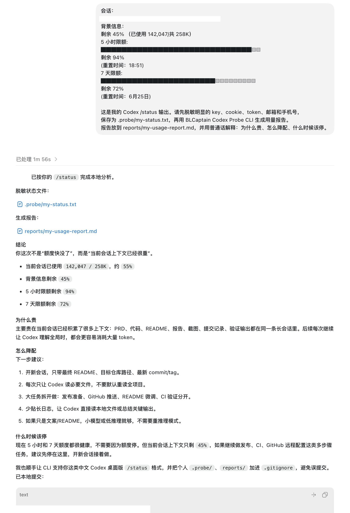

# BLCaptain Codex Probe CLI

> 本地只读的 Codex 用量治理与 Skill / 输出质量体检 CLI：解释为什么贵、怎么降配、什么时候该停。

[English README](README.en.md)


> **最快使用方式**：
>
> 不用先理解命令行。打开 Codex 桌面版 App，把这个仓库目录作为工作目录，然后复制 [Codex 桌面版提示词](docs/CODEX_DESKTOP_PROMPT.md) 给 Codex。
>
> ```text
> 请用 BLCaptain Codex Probe CLI 分析我下面提供的 /status：
> 为什么贵、怎么降配、什么时候该停。
> 只处理我显式提供的文本，不要读取浏览器、cookie、token 或私密目录。
> ```

> **开发者安装**：
>
> ```bash
> git clone https://github.com/dososo/BLCaptain-Codex-Probe-CLI.git
> cd BLCaptain-Codex-Probe-CLI
> python3 -m venv .venv
> . .venv/bin/activate
> python -m pip install .
> ```

---

## 工作截图

<p>
  
</p>

在 Codex 桌面版 App 里，一句话就可以让 Codex 完成本地安装、导入示例数据、生成报告、体检 Skill 和删除验证。

| 任务级用量报告 | Skill / 输出质量体检 |
|---|---|
|  |  |
| 把 `total_tokens`、预算状态、剩余额度和停止建议放在同一视图，方便判断“继续、降配还是先停”。示例报告见 [examples/reports/usage-report.md](examples/reports/usage-report.md)。 | 标出 AI 味、插件风险、敏感信息和隐私边界缺口，并展示脱敏后的证据片段。示例报告见 [examples/reports/skill-lint-report.md](examples/reports/skill-lint-report.md)。 |

## 它到底是什么

BLCaptain Codex Probe CLI 是一个本地命令行工具，不是 Codex Skill，也不是 OpenAI 官方 dashboard。它真正想解决的不是“多一个命令”，而是让 Codex 用户在长会话里更早知道：**这次为什么贵、怎么降配、什么时候该停**。

它解决两个具体问题：

1. **任务级 Token / 额度治理**：导入用户显式提供的 `/status` 文本或手工 JSON，生成任务级用量报告，解释贵在哪里、是否接近预算、下一步该降配还是停止。
2. **Skill / 输出质量体检**：导入 Skill、提示词或 AI 输出文本，检查 AI 味、插件风险、缺失验收、隐私边界和敏感信息泄露风险。

它的定位是 **Watch / 验证型 v0.3**：适合真实用户本地试用和开源验证，但不承诺省钱、无限额度、额度翻倍或商业成功。

如果你不是开发者，也可以只把它当作一份可复制工作流：把 `/status` 贴给 Codex，让 Codex 调用本地 CLI 生成报告。CLI 只是底层工具，用户入口是一句话。

## 命名约定

| 用途 | 名称 |
|---|---|
| 产品名 | BLCaptain Codex Probe CLI |
| GitHub 仓库名 | `BLCaptain-Codex-Probe-CLI` |
| Python 包名 | `blcaptain-codex-probe` |
| 公开命令 | `codex-probe` |
| 短别名 | `probe` |
| 兼容命令 | `blcaptain-codex-probe`、`codex-usage-skill-probe` |

为什么不叫 Skill：它不是给 Agent 读取的 Skill 指令包，而是用户和 Agent 都可以调用的本地 CLI。它可以检查 Skill，但它本身不是 Skill。

## 为什么要做它

很多 Codex 用户遇到的问题不是“不会写提示词”，而是过程失控：

1. **不知道为什么贵**：任务跑完才发现上下文很大、输出很长、模式选重了，但没有任务级解释。
2. **不知道怎么降配**：只知道额度紧张，却不知道该拆任务、复用缓存、换模型，还是先停下来保存结果。
3. **Skill 和输出质量不稳定**：装错插件、提示词太模板化、交付内容 AI 味重，最后还要人工返工。
4. **安全边界模糊**：示例里夹带 API key、cookie、手机号、邮箱，或者出现绕登录、拼车、规避计费等不该进入 P0 的能力。

BLCaptain Codex Probe CLI 的原则很简单：**只分析用户显式给出的本地材料；只给可复核建议；不代理、不绕过、不上传。**

## 它能给你什么

| 维度 | 内容 |
|---|---|
| **输入** | `/status` 文本、手工 JSON、Skill 文件、提示词、AI 输出文本 |
| **存储** | 本地 SQLite，默认路径由用户通过 `--db` 指定 |
| **分析** | Token / credits / 剩余额度、预算风险、降配建议、停止建议 |
| **体检** | AI 味、插件风险、缺失验收、缺失隐私边界、敏感信息脱敏 |
| **输出** | Markdown 报告、JSON 命令输出、可复核 evidence_id |
| **删除** | `delete --all --yes` 清空本地业务数据，保留最小审计日志 |

## 它解决什么事

适合这些场景：

- 你想知道某次 Codex 任务为什么 Token / 额度消耗高。
- 你想把“继续做 / 降配做 / 停止做”变成可解释决策。
- 你想在发布 Skill 或交付 AI 输出前做一次质量体检。
- 你想给轻开发、内容创作者或内部团队一个本地可跑的检查工具。
- 你想保留隐私边界，不把用量、Skill 或输出上传到云端。

不适合这些场景：

- 想替代 OpenAI 官方 usage dashboard 或 `/status`。
- 想自动读取 Codex 登录态、浏览器 cookie、系统凭据或生产数据。
- 想代理、拦截、修改 Codex 请求。
- 想绕过登录、手机号、订阅、地区限制或官方计费。
- 想保证省钱、无限额度、额度翻倍或商业成功。

## 核心能力

### 1. 用量导入

如果你使用 **Codex 桌面版 App**，可以不用先理解命令。打开本仓库目录后，直接对 Codex 说：

```text
请使用 BLCaptain Codex Probe CLI 帮我做一次本地用量分析：
1. 如果还没安装，请在本项目里创建本地虚拟环境并安装。
2. 导入 examples/status.txt。
3. 生成任务级用量报告到 reports/usage-report.md。
4. 体检 examples/risky-skill.md，报告放到 reports/skill-lint-report.md。
5. 最后告诉我报告路径、主要风险、建议降配还是停止。
不要上传任何数据，不要读取浏览器 cookie、token 或系统凭据。
```

如果你要分析自己的 `/status`，可以把文本贴给 Codex，然后说：

```text
这是我的 Codex /status 输出。请先脱敏明显的 key、cookie、token、邮箱和手机号，
保存为 .probe/my-status.txt，再用 BLCaptain Codex Probe CLI 生成用量报告。
报告放到 reports/my-usage-report.md，并用普通话解释：为什么贵、怎么降配、什么时候该停。
```

执行效果示例：

<p align="center">
  
</p>

支持两种导入方式：

```bash
codex-probe --db .probe/demo.db import \
  --status examples/status.txt \
  --goal "生成交付报告"
```

```bash
codex-probe --db .probe/demo.db import \
  --manual-json examples/manual-usage.json \
  --goal "手工样本验收"
```

导入只处理用户明确提供的本地文件，不主动扫描系统目录。

### 2. 任务级用量报告

```bash
codex-probe --db .probe/demo.db usage-report \
  --budget-tokens 100000 \
  --out reports/usage-report.md
```

报告会输出：

- 当前任务的模型、模式、输入 token、输出 token、缓存 token、总 token。
- 是否超过预算或接近预算。
- 是否建议降配、拆任务、复用缓存输入或停止非必要动作。
- 与 PRD 证据绑定的 `evidence_id`，例如 `E-011`、`E-012`、`E-013`。

### 3. Skill / 输出质量体检

```bash
codex-probe --db .probe/demo.db skill-lint \
  examples/risky-skill.md \
  --out reports/skill-lint-report.md
```

体检会检查：

- AI 味和模板化表达。
- 自动安装插件、绕登录、拼车、规避计费等风险表达。
- 是否缺少验收标准。
- 是否缺少隐私和删除边界。
- 是否出现 API key、cookie、token、邮箱或手机号等敏感信息。

### 4. 本地删除

```bash
codex-probe --db .probe/demo.db delete --all --yes
```

删除后再次生成用量报告应返回：

```json
{
  "ok": false,
  "error": {
    "code": "NO_USAGE_DATA"
  }
}
```

## 安装

环境要求：

- Python 3.10+
- 能运行本地命令行
- 不需要 OpenAI API Key
- 不需要登录 Codex

本地安装：

```bash
git clone https://github.com/dososo/BLCaptain-Codex-Probe-CLI.git
cd BLCaptain-Codex-Probe-CLI
python3 -m venv .venv
. .venv/bin/activate
python -m pip install .
codex-probe --version
```

安装后可使用：

```bash
codex-probe --version
blcaptain-codex-probe --version
probe --version
```

## 怎么用

最友好的方式，是在 **Codex 桌面版 App** 中打开这个仓库目录，然后说一句：

```text
请用 BLCaptain Codex Probe CLI 跑一次完整本地验收：
安装依赖，导入 examples/status.txt，生成用量报告，
体检 examples/risky-skill.md，删除本地业务数据后确认返回 NO_USAGE_DATA。
完成后只给我报告路径、关键风险、下一步建议和验证结果。
```

如果你已经有自己的 `/status` 或 Skill 文本，可以这样说：

```text
请用 BLCaptain Codex Probe CLI 分析我下面提供的材料。
目标：解释这次 Codex 任务为什么贵、怎么降配、什么时候该停；
同时检查 Skill / 输出有没有 AI 味、插件风险、缺失验收或敏感信息。
请只处理我显式提供的文本，不要读取浏览器、登录态、cookie、token 或其他私密目录。
```

Codex 会替你执行下面这些命令；你也可以自己手动运行。

最小工作流：

```bash
mkdir -p .probe reports

codex-probe --db .probe/demo.db import \
  --status examples/status.txt \
  --goal "生成交付报告"

codex-probe --db .probe/demo.db usage-report \
  --budget-tokens 100000 \
  --out reports/usage-report.md

codex-probe --db .probe/demo.db skill-lint \
  examples/risky-skill.md \
  --out reports/skill-lint-report.md

codex-probe --db .probe/demo.db delete --all --yes
```

你会得到：

1. 一份任务级用量自查报告。
2. 一份 Skill / 输出质量体检报告。
3. 一组 JSON 命令输出，便于 Agent 或脚本继续处理。
4. 删除后的 `NO_USAGE_DATA` 可验证结果。

## 工作流：八步本地验收法

这个 CLI 的开发和验收始终按八步走：

1. **调研**：读取 PRD、样例、用户场景和边界。
2. **分析**：确定输入格式、风险规则、错误码和报告结构。
3. **计划**：拆分 P0 命令、测试、验收和开源发布材料。
4. **开发**：实现 CLI、SQLite、报告生成、脱敏和删除能力。
5. **验证**：跑通导入、报告、体检、删除的端到端剧本。
6. **测试**：运行单元测试和等价静态检查。
7. **审计验收**：检查 README、LICENSE、CHANGELOG、CI、隐私安全和发布清单。
8. **总结**：记录完成情况、剩余风险和下一版建议。

任一步失败，都先读日志和证据，不用猜测补丁糊过去。

## 本地命令

自动化测试：

```bash
PYTHONPATH=src python3 -m unittest discover -s tests
```

语法检查：

```bash
python3 -m compileall src tests scripts/run_acceptance.py
```

端到端验收：

```bash
python3 scripts/run_acceptance.py
```

验收脚本会生成本地证据目录：

```text
acceptance-artifacts/<timestamp>/
├── commands.md
├── commands.json
├── usage-report.md
├── skill-lint-report.md
└── probe.db
```

`acceptance-artifacts/` 已被 `.gitignore` 忽略，不应提交到 GitHub。

## 示例与提示词

| 文件 | 用途 |
|---|---|
| `docs/CODEX_DESKTOP_PROMPT.md` | 可复制到 Codex 桌面版的一句话工作流 |
| `docs/SOCIAL_POSTS.md` | X 和小红书发布短文草稿 |
| `examples/status.txt` | `/status` 文本样本 |
| `examples/manual-usage.json` | 手工 JSON 用量样本 |
| `examples/risky-skill.md` | 含 AI 味、插件风险和假密钥的风险样例 |
| `examples/clean-skill.md` | 相对安全的 Skill 样例 |
| `examples/optimized-skill.md` | 根据体检报告优化后的 Skill 样例 |
| `examples/reports/optimized-skill-lint-report.md` | 优化版 Skill 的体检报告 |

示例中的密钥是无效假数据；报告会脱敏常见 API key、token、cookie、邮箱和手机号。

## 数据与隐私

- 不登录 OpenAI 或 Codex。
- 不读取浏览器 cookie、token、钥匙串或系统凭据。
- 不代理、拦截或修改 Codex 请求。
- 不绕过登录、手机号、订阅、地区或官方计费。
- 不上传数据到云端。
- 不自动安装、启用或修改 Skill。
- 默认只处理用户显式提供的本地文件。
- 本地业务数据可用 `delete --all --yes` 删除。

详见 [隐私与安全说明](docs/PRIVACY_SECURITY.md)。

## 目录结构

```text
BLCaptain-Codex-Probe-CLI/
├── assets/screenshots/               # README 工作截图
├── examples/reports/                  # 真实示例报告
├── README.md                         # 项目说明
├── CHANGELOG.md                      # 版本更新记录
├── LICENSE                           # MIT License
├── pyproject.toml                    # Python 包与 CLI 入口
├── docs/
│   ├── CODEX_DESKTOP_PROMPT.md       # Codex 桌面版提示词
│   ├── PRIVACY_SECURITY.md           # 隐私与安全边界
│   ├── RELEASE_CHECKLIST.md          # 发布前检查清单
│   └── SOCIAL_POSTS.md               # 社媒短文草稿
├── examples/                         # 可复现样例
├── scripts/
│   └── run_acceptance.py             # 端到端验收脚本
├── src/codex_usage_skill_probe/       # CLI 源码
└── tests/                            # 单元测试与端到端测试
```

## 验证标准

发布 v0.3 前必须满足：

- 可以从干净环境 `python -m pip install .` 安装。
- `codex-probe --version` 返回当前版本。
- 能导入 `/status` 或手工 JSON 样本。
- 能生成任务级用量报告。
- 能生成 Skill / 输出质量体检报告。
- 能删除本地业务数据。
- 删除后再次报告返回 `NO_USAGE_DATA`。
- 报告不泄露完整 API key、cookie、token、邮箱或手机号。
- README、LICENSE、CHANGELOG、CI、隐私说明和发布清单齐全。

当前本地验收证据：

```text
PYTHONPATH=src PYTHONDONTWRITEBYTECODE=1 python3 -m unittest discover -s tests
.....
Ran 8 tests
OK

PYTHONDONTWRITEBYTECODE=1 python3 -m compileall src tests scripts/run_acceptance.py
OK

PYTHONDONTWRITEBYTECODE=1 python3 scripts/run_acceptance.py
acceptance passed: acceptance-artifacts/20260622T094640Z
```

## Roadmap

- 支持更多 `/status` 文本样式。
- 增加 HTML / JSON 报告 schema 快照测试。
- 增加更细的 Skill 风险规则。
- 增加多任务用量趋势对比。
- 增加报告模板定制。
- 提供 Homebrew / uvx 等更轻的安装方式。

## FAQ

**Q：它是 Codex Skill 吗？**

A：不是。它是 CLI。它可以检查 Skill 或输出文本，但本身不是给 Agent 读取的 Skill 指令包。

**Q：它需要 OpenAI API Key 吗？**

A：不需要。它只分析你显式提供的本地文本或 JSON。

**Q：它能直接读取我的 Codex 用量吗？**

A：不会主动读取登录态或官方后台。你需要手动提供 `/status` 文本或手工 JSON。

**Q：它能保证省钱吗？**

A：不能。它只能解释风险、给出降配和停止建议，最终仍要由你判断。

**Q：它会保存我的数据吗？**

A：只保存到你指定的本地 SQLite 文件。你可以用 `delete --all --yes` 删除业务数据。

**Q：为什么还保留 `probe` 命令？**

A：`codex-probe` 是公开主命令，`probe` 是短别名，方便本地使用和脚本兼容。

## 关于作者

由 **爆裂队长NEXT（BLCaptain）** 独立创作与维护。

- GitHub：[@dososo](https://github.com/dososo)
- X / Twitter：[@thinkszyg](https://x.com/thinkszyg)
- 邮箱：[blteam2026@outlook.com](mailto:blteam2026@outlook.com)
- 开源中国传统纹样图录项目维护者：[wenyang.net](https://wenyang.net)

如果这个项目对你有帮助，欢迎 Star、分享，或在 X 上 @我交流。

## License

MIT License. See [LICENSE](LICENSE).
